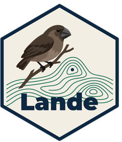

# Lande 

Stroud lab's Lande-Arnold toolkit for measuring phenotypic selection.

The package estimates selection differentials and linear (beta), quadratic
(gamma) and correlational (gamma_ij) selection gradients, fits spline fitness
functions and two-trait fitness surfaces, and computes the adaptive landscape
of mean fitness against the population mean. Each of these can be repeated by
year, and several groups can sit on one surface.

Traits are standardised to mean 0 and SD 1 and fitness is relativised (w / mean w)
before fitting. Quadratic gradients and their standard errors are doubled
(Stinchcombe et al. 2008); correlational gradients are not. For binary fitness the
gradients come from OLS on relative fitness and the p-values from a logistic GLM;
count fitness gets its p-values from a Poisson GLM, or a negative binomial one when
the counts are overdispersed.

## Installation

```r
# install.packages("remotes")
remotes::install_github("Human-Augment-Analytics/Lande")
```

## Gradients

```r
library(Lande)

traits <- c("weight", "total_length", "humerus")

# Standardise traits and add relative fitness
prepared <- prepare_selection_data(bumpus, "survival", traits)

# Selection gradients
selection_coefficients(bumpus, "survival", traits, fitness_type = "binary")

# Differentials and gradients in one table
selection_report(bumpus, "survival", traits, fitness_type = "binary")

# Bootstrap standard errors and intervals
bootstrap_selection(bumpus, "survival", traits, fitness_type = "binary")

# Assumption checks: normality of the traits, VIF, rows per term, residuals
check_selection_assumptions(bumpus, "survival", traits)

# One set of gradients per sex, each sex standardised on its own
selection_coefficients(bumpus, "survival", traits, group = "sex", return_grouped = TRUE)

# Canonical axes of the gamma matrix
canonical_analysis(bumpus, "survival", traits)
```

## Fitness functions and surfaces

```r
# cubic spline, Wald band by default, bootstrap band with bootstrap = TRUE
uni <- univariate_spline(prepared, "survival", "weight")
plot_univariate_fitness(uni, "weight")

# two-trait surface, blank outside the convex hull of the data
surf <- correlated_fitness_surface(prepared, "survival", c("weight", "total_length"))
plot_correlated_fitness(surf, c("weight", "total_length"), show_points = TRUE)
```

`too_far` also blanks cells farther than a share of the axis range from any
individual, as in Beausoleil et al. (2023). With `group` set and
`group_effect = FALSE` one surface is fitted to everyone and each group's mean
and highest point are marked, which puts several species on one surface. The
highest point is filled for a peak and open otherwise.

A GAM surface carries its standard error and a band. `uncertainty = "se"` or
`"band"` in the plots draws them, and `peak_difference()` compares the fitted
fitness at two points, or each with the pass between them.

## Adaptive landscapes

```r
land <- adaptive_landscape(prepared, surf$model, c("weight", "total_length"))
plot_adaptive_landscape(land, c("weight", "total_length"))

# one trait, from the spline
land1 <- adaptive_landscape(prepared, uni$model, "weight")
plot_adaptive_landscape(land1, "weight")
```

## Over time

```r
finch <- prepare_selection_data(finch_yearly, "survived", "beak_pc1")
years <- temporal_landscape(finch, "survived", "beak_pc1", "year")
years$summary
plot_temporal_landscape(years)
plot_temporal_landscape(years, type = "heatmap")
```

## App

`run_app()` opens the analysis in a browser: bundled or uploaded data,
gradients, fitness functions, surface, landscape and per-group results, with
the fitting options in Advanced settings. Needs `shiny`; `plotly` adds the
rotatable 3D landscape. The app lives in `inst/app`; see its README there.

## Data

- `bumpus`: Bumpus's 1898 house sparrows, 136 birds, nine traits and survival.
- `crescent_pond_pupfish` and `little_lake_pupfish`: the pupfish of Martin
  (2016), F2 hybrids in field enclosures in two lakes and laboratory-reared
  fish of the three parental species. Martin's analyses use the high-density
  enclosures, `density == "H"`, and so do the examples and the app.
- `finch_yearly`: the yearly medium ground finch data of Beausoleil et al.
  (2019), with survival as being seen again in any later year.
- `finch_community`: the five-group finch community of Beausoleil et al.
  (2023), with apparent lifespan as fitness and the year each bird was first
  caught.

Each has a help page with its columns and source. The pupfish and finch data
are also in `inst/extdata` as CSV files.

## Notes

`detect_family()` classifies fitness as binary, count or continuous and picks
the model used for the p-values; the gradients themselves always come from OLS
on relative fitness. The spline uses a cubic regression basis with the
smoothing chosen by GCV (UBRE for survival and Poisson counts) and the
surface a thin-plate basis chosen by REML; both can be changed with `bs` and
`smoothing`.

See `vignette("evolutionary-selection-analysis")` for the maths and worked
examples.
